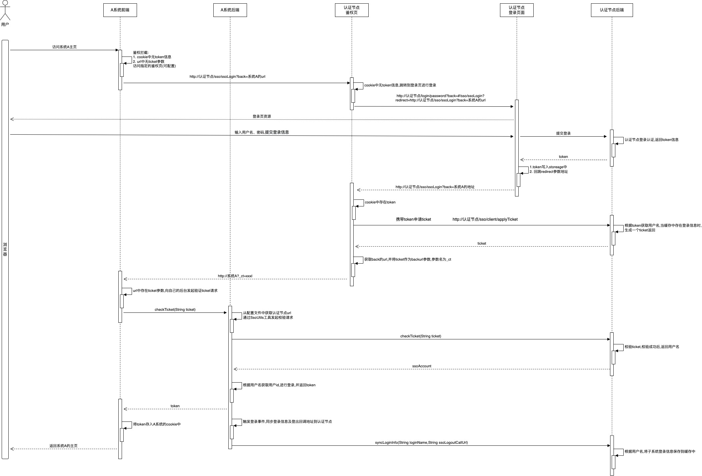

# SCREW-SSO 单点登录模块
screw-sso单点登录插件是基于框架screw-auth-core认证模块打造，意在为多种使用场景提供统一便捷的统一认证解决方案。
实现在多个互相信任的系统中，携带登录凭据后可在多个系统之间进行单点登录。


## 简述
### 背景
在很多的单点登录方案中，为了实现后台登录会话共享，都会引入中间件redis作为会话共享存储，但目前很多系统并没有引入redis这个中间件，且不希望引入redis增加部署难度，业务系统需要一套配置便捷、sso集成难度小的单点登录方案
### 解决什么问题
首先多个系统之间，为什么无法同步登录状态？

1. 前端不同域，前端的Token无法在多个系统下共享，无法判断用户是否已在其他系统登录
2. 后端不同存储，后端的Session无法在多个系统间共享，登录信息无法同步

在不增加系统部署难度的背景下，screw-sso为了解决以上两个问题，实现了：
1. 前端通过中间鉴权页面的方式判断用户是否已登录
2. 后端不借助引入第三方中间件实现session共享，通过接口调用的方式同步各子系统的登录信息

### 架构选型
screw-sso采用了和`CAS`十分类似的架构，从逻辑上分为服务端和客户端，因此使用了screw-sso方案的业务系统可以和已经集成了类CAS方案的其他业务系统进行无缝集成，和`CAS`相比不同的是：
1. 多个业务子系统在集成screw-sso后，任意一个子系统都可作为服务端对外签发ticket凭据，**作为服务端的子系统下面将统一称为"认证节点"**
2. `CAS`页面跳转由后端进行redirect，而screw-sso的页面redirect完全由前端控制，后端只提供接口服务
3. `CAS`使用额外的统一登录页进行登录认证，而screw-sso的"单点登录认证过程"使用的是认证节点的原有登录页和登录逻辑

### 单点登录时序图
下图所示展示了单点登录中子系统与认证节点交互的过程，在A系统登录后，在另外一页面中直接访问B系统的流程基本相同，只是没有了跳转认证节点登录页的过程，故图中省略。


### 安全性策略
1. 参数签名，系统之间的接口调用加入签名和验签环节，防止传递的参数被修改
2. 参数增加时间戳防止重放攻击，接收到的请求默认的时间差不允许超过60s
3. 请求来源校验，以servlet环境为例，请求来源标识为ip地址，即：<br/>
   一个token凭据只会对应一个ip地址，当发现请求来源ip与登录时的ip不一致时，会抛出认证异常

### SCREW-SSO 特性
1. API 简单易用，文档介绍详细，且提供直接可用的集成示例。
2. 不论是否跨域、是否前后端分离，都可以完美解决。
3. 安全性高：内置请求来源校验、秘钥校验等，杜绝参数修改、token重放攻击等常见攻击手段。
4. 无缝集成：由于screw-auth-core本身就是就包含了权限认证核心功能，因此你可以只用screw框架同时解决权限认证 + 单点登录问题，让你不再到处搜索：xxx单点登录与xxx权限认证如何整合……
5. 高可定制：screw-SSO模块对代码架构侵入性极低，仅对外提供SsoUtil工具类，你可以非常轻松的定制化开发。
6. 无缝兼容使用类`CAS`方案的系统单点登录集成，即可以在使用了`CAS`方案的系统A和使用了screw-SSO方案的系统B之间进行单点登录


## 集成步骤
集成的两个系统都需要按照下面的步骤配置一次,作为主系统的系统将对外提供CAS能力

### 步骤一：依赖引入

```xml
<!-- SCREW-SSO 插件 -->
<dependency>
   <groupId>com.ds.screw</groupId>
   <artifactId>screw-auth-sso</artifactId>
   <version>1.0</version>
</dependency>
```

### 步骤二：Properties配置

```properties
# SSO-相关配置

# 是否打开单点登录
config.auth.sso.enable=true
# 系统编号，请务必保证多个系统间的系统编码唯一
config.auth.sso.systemCode=demo-client2
# SSO-Server端 作为认证节点的子系统地址
config.auth.sso.serverUrl=http://ssoclient1.com:9001/
# 是否打开单点注销(只对server端有效，决定server端是否向其他子系统广播登出请求)
config.auth.sso.ssoLogoutEnable=true
# 当前系统的地址，用于server端向client端发起单点注销回调请求，为空时后台则根据request请求自动获取
config.auth.sso.ssoLogoutCall=http://ssoclient2.com:9002/
# Ticket有效期 (单位: 秒)
config.auth.sso.ticketTimeout=60
# sso登录信息保存有效期 (单位: 秒)，默认6小时
config.auth.sso.ssoLoginTimeout=21600
# 接口调用时的时间戳允许的差距（单位：ms），-1代表不校验差距
config.auth.sso.timestampDisparity=60000

```
以下四个配置项必须要配置,其它不配置使用默认配置即可：
- config.auth.sso.enable，値修改为true
- config.auth.sso.systemCode，值为系统在集成系统中的唯一编码，不能重复
- config.auth.sso.serverUrl，値修改为主系统的实际部署访问地址（路径写到context上下文路径）
- config.auth.sso.ssoLogoutCall，值修改为当前系统(如果是主系统该地址配置成自己)的实际部署访问地址（路径写到context上下文路径）

此时后台的sso集成已经准备完成，还需要前端做一些地址上的配置便可以使用sso了

### 步骤三：前端env.config.json文件覆盖
1. 在项目部署到tomcat后，先不要启动
2. 进入到tomcat的webapps/demo-server/www/demo/路径下(该地址和index.html同路径，没有www/demo路径时，需要自行创建)。新建env.config.json文件，修改`VUE_APP_SSO_PROXY_SERVER_PATH`值后启动tomcat即可。
```json

{
    "VUE_APP_SSO_ENABLED" : true,
    "VUE_APP_SSO_PROXY_SERVER_PATH": "https://127.0.0.1:18090/demo-server/www/demo/index.html"
}

```

::: tip 说明

1. `VUE_APP_SSO_ENABLED` ：是否开启SSO
2. `VUE_APP_SSO_PROXY_SERVER_PATH` ：为前端项目index.html主页路径

:::


## 与第三方CAS集成说明
SCREW-SSO可与第三方CAS无缝集成，其思想是：**主系统借助CAS登录,在统一登录页生成token，剩下的登录流程将由SCREW-SSO借助其生成的token向主系统后台申请SCREW-SSO的ticket登录**

集成步骤如下：

1. 步骤一：主系统进行CAS开发
2. 步骤二：SCREW-SSO集成步骤进行配置（所有系统都要配置）
   