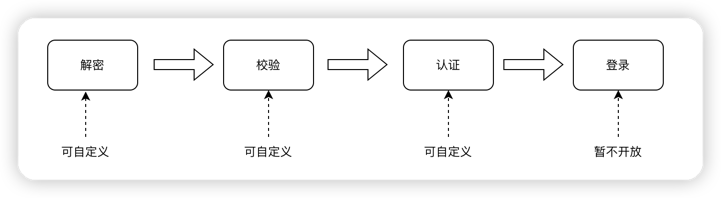

# 登录
对于一些登录之后才能访问的接口（例如：查询我的账号资料），我们通常的做法是增加一层接口校验：
* 如果校验通过，则：正常返回数据。
* 如果校验未通过，则：抛出异常，告知其需要先进行登录。

所谓登录认证，指的就是服务器校验账号密码，为用户颁发 Token 会话凭证的过程，这个 Token 也是我们后续通过接口校验的关键所在。


## 登录与登出
在框架中，对于用户的登录与登出十分简单。
```java
// 会话登录：参数填写要登录的账号id, screw框架中该id指的是用户id
AuthUtil.login(String loginId);

// 当前会话注销登录
AuthUtil.logout();

// 登出指定的loginId
AuthUtil.logout(String loginId);

```

为充分体现API设计的简单与优雅，只需一句代码，便可以使会话登录成功，但实际上，框架的screw-auth-starter模块在背后做了大量的工作，包括但不限于：

1. 检查此账号是否之前已有登录
2. 为账号生成 Token 凭证与 Session 会话
3. 通知全局侦听器，xx 账号登录成功
4. 将 Token 注入到请求上下文
5. 等等其它工作……

你暂时不需要完整的了解整个登录过程，你只需要记住关键一点：screw-auth-starter模块为这个账号创建了一个Token凭证。之后便可以通过下面的方法获取到token并返回给前端，
```java
// 获取当前会话的token
AuthUtil.getTokenValue();
```

所以一般情况下，如果你想要单独引入框架的screw-auth-starter登录认证功能，我们的登录接口代码，会大致类似如下：
```java

@PostMapping("/login")
public ApiResponse<Object> login(String userName,String pwd) {
    // 第一步：比对前端提交的账号名称、密码
    if("screw".equals(userName) && "123456".equals(pwd)) {
        // 第二步：根据账号id，进行登录 
        AuthUtil.login(10001);
        // 第三步：返回token信息
        return new ApiResponse<>().success(AuthUtil.getTokenValue());
    }else{
        return new ApiResponse<>().failure(ApiEnumCode.ACCOUNT_NAMEORPW_ERROR);
    }
}

```

## 会话查询与校验

```java
// 获取当前会话账号id, 未登录时为null
AuthUtil.getLoginId();

// 获取当前会话的token值
AuthUtil.getTokenValue();

// 获取当前会话是否已经登录，返回true=已登录，false=未登录
AuthUtil.isLogin();

// 检验当前会话是否已经登录, 如果未登录，则抛出异常：`UnLoginException`
AuthUtil.checkLogin();

```
其中异常`UnLoginException`代表当前会话暂未登录，可能的原因有很多： 前端没有提交 Token、前端提交的 Token 是无效的、前端提交的 Token 已经过期 …… 等等。

## 配置项说明
你可以零配置启动框架

但同时你也可以通过配置文件，定制性使用框架的登录认证功能
### 登录相关配置项
配置示例：
```properties
config.security.login.filterEnabled=true
```
| 配置项 <br/>(前缀 config.security.login) | 类型    | 默认值   | 说明  <br/>(其中可替代配置项为兼容旧版本使用，未配置过的不建议使用)                                                                                  |
|----------------------------------| ------ |-------|-------------------------------------------------------------------------------------------------------------------------|
| filterEnabled                    | boolean | true  | 是否开启登录过滤器<br/>可替代配置项:config.security.login.filter.enabled                                                               |
| singleSession                    | boolean | true  | 是否允许账号异地登录，为false时，在后一设备登录的账号将会把之前登录的设备踢下线<br/>可替代配置项:config.security.login.online.singleSession                        |
| maxOnlineSession                 | int    | 5     | 单个账号最多登录会话限制，当值<=0时表示不限制<br/>可替代配置项:config.security.login.online.maxNumber                                              |
| whitelist                        | String | “”    | 登录校验白名单地址,不过滤的Url，多个url用逗号分隔,URL路径是去掉IP和端口后的URL                                                                         |
| hostBlacklist                    | String |  “”   | 登录黑名单IP拦截,多个ip使用','分割，支持拦截指定IP段开头的所有IP，如拦截25段下的所有IP，配置为：192.168.25 即可  <br/>可替代配置项:config.security.login.host.blacklist |
| maxRetryTimes                    | int    | 3     | 连续登录失败可重试次数，超过次数将会被锁定<br/>可替代配置项:config.security.login.retry.maxTimes                                                   |
| autoUnLockDuration               | int    | 30    | 登录失败次数过多导致的登录锁定时长（单位：分钟)<br/>可替代配置项:config.security.login.autoUnlock.duration                                           |
| verifyCodeEnabled                | boolean | true  | 是否开启验证码校验<br/>true:校验,false:不校验<br/>可替代配置项:config.security.login.verifyCode.enabled                                     |
| tokenTimeout                     | int    | 10080 | token 票据有效期，默认为7天（单位：分钟）                                                                                                |
| sessionTimeout                   | int    | 60    | session 会话有效期（单位：分钟），也值token临时有效期 [指定时间内无操作就视为token过期]                                                                  |
| remoteStrategy                   | String | 9     | 异地登陆策略,可选值参考：[异地登陆策略](./#异地登录策略)                                                                                        |


### 认证相关配置项
| 配置项 <br/>(前缀 config.security.auth) | 类型   | 默认值          | 说明   <br/>(其中可替代配置项为兼容旧版本使用，未配置过的不建议使用)                                                      |
| -------------------------------------- | ------ | --------------- | ------------------------------------------------------------ |
| passwordValidity                       | int    | 7               | 设置用户密码有效期(单位:天),负数或0表示不判断,正数表示判断<br/>可替代配置项:config.security.login.pwd.valiDate |
| passwordReuseLimit                     | int    | 5               | 用户修改密码不允许最近使用的次数<br/>可替代配置项:config.security.login.pwd.duplicate |
| defaultPassword                        | String | !@#admin        | 用户默认密码                                                 |
| pwdMinLength                           | int    | 8               | 用户密码的最小长度<br/>可替代配置项:config.security.login.pwd.minLength |
| pwdMaxLength                           | int    | 12              | 用户密码的最大长度<br/>可替代配置项:config.security.login.pwd.maxLength |
| noAuthBusinessIds                      | String | 400000000,90001 | 免授权业务ID，逗号隔开<br/>可替代配置项:                     |


## 异地登录策略
配置示例：
```properties
# 异地登陆策略
config.security.login.remoteStrategy=9
```

| 可选值 | 说明                                                         |
|-----| ------------------------------------------------------------ |
| 0   | 允许异地登录：不论IP，不论设备类型场景下，允许同一账号同时登录，不执行踢人下线策略<br/>>>任意IP，任意终端都允许同时登录 |
| 1   | 允许异地登录：相同IP，不论设备类型场景下，允许同一账号同时登录，需要将当前账号的其它IP的登录踢下线<br/>>>同一台主机允许同时登录浏览器、APP等 |
| 2   | 允许异地登录：相同IP，相同设备类型场景下，允许同一账号同时登录，需要将当前账号的其它IP或者其它设备类型的登录踢下线<br/>>>同一台主机允许同时登录不同的浏览器，但不允许同时登录浏览器和APP |
| 3   | 允许异地登录：相同IP，不同设备类型场景下，允许同一账号同时登录，需要将当前账号的其它IP或者当前设备类型的登录踢下线<br/>>>同一台主机不允许同时登录两种浏览器，但允许同时在浏览器或APP上执行登录 |
| 4   | 允许异地登录：不同IP，不论设备类型场景下，允许同一账号同时登录，需要将当前账号的当前IP的登录踢下线<br/>>>同一台主机上不管什么设备都不允许同时登录，但不同的IP可以 |
| 5   | 允许异地登录：不同IP，相同设备类型场景下，允许同一账号同时登录，需要将当前账号的当前IP或者其它设备类型的登录踢下线<br/>>>不同的主机允许同时登录浏览器，但不允许一台主机登录浏览器，一台主机登录APP |
| 6   | 允许异地登录：不同IP，不同设备类型场景下，允许同一账号同时登录，需要将当前账号的当前IP或者当前设备类型的登录踢下线<br/>>>一台主机登录了app、一台主机登录了浏览器 |
| 9   | 禁止异地登录：禁止其它登录，将登录账号关联的所有其它登录全部踢下线 |


## 登录登出事件
用户登录、登出都会产生一个事件，你可以监听该事件，并在事件中执行一些前置或后置的操作

### 登录成功事件
登录成功后触发，代码示例：
```java
@Component
public class CustomLoginListener implements ApplicationListener<LoginEvent> {
    @Override
    public void onApplicationEvent(LoginEvent event) {
        // do something
    }
}
```

::: tip 提示

框架提供了默认的登录事件`DefaultLoginListener`,如果你想要覆盖的话，将上述的代码示例的类名或bean的别名改成`DefaultLoginListener`即可

:::

### 临时登录事件
临时登录成功后触发，代码示例：
```java
@Component
public class CustomTempLoginListener implements ApplicationListener<TempLoginEvent> {

    @Override
    public void onApplicationEvent(TempLoginEvent event) {
        // do something
    }
}
```

::: tip 提示

框架提供了默认的临时登录事件`DefaultTempLoginListener`,如果你想要覆盖的话，将上述的代码示例的类名或bean的别名改成`DefaultTempLoginListener`即可

:::

### 登出前事件
即将登出前触发，代码示例：
```java
@Component
public class CustomBeforeLogoutListener implements ApplicationListener<BeforeLogoutEvent> {

    @Override
    public void onApplicationEvent(BeforeLogoutEvent beforeLogoutEvent) {
        // do something
    }
}
```
::: tip 提示

如果你想要打断登出，在代码中抛出异常即可。

:::

## 自定义登录
该版本登录总体分为四步：解密->校验->认证->登录 ，除登录暂未开放外，其它三个阶段都可进行自定义

### 自定义解密
解密阶段是将前台传入的数据进行解密，并在最后返回一个localUser用户信息对象，localUser对象在后续的步骤中都将用到。

默认解密阶段做了三件事，分别对应下面三个方法，可以通过继承DefaultLoginCheckHandler并重写的方式进行自定义修改：

- DefaultLoginCheckHandler
    - parseModel
        - parsePayload：解密前端数据
        - checkCode：校验ticket凭据，默认的ticket是在验证码校验成功后生成
        - retrieveUser：根据用户名查找本地用户信息并封装成localUser对象

自定义解密实现示例：
```java
import com.ds.cs.screw.separate.bean.auth.LoginModel;
import com.ds.cs.screw.separate.bean.sso.LoginReq;
import org.springframework.stereotype.Component;
import com.ds.cs.screw.separate.bean.auth.LocalUser;

/**
 * @Description: 自定义的登录校验认证处理器
 */
@Component
public class CustumLoginCheckHandler extends DefaultLoginCheckHandler{


    /**
     * 前端使用rsa公钥加密，后端通过LoginReq中的sess查找对应的私钥解密
     * 一般该方法需要重写的场景很少
     * @param loginReq
     * @return
     */
    @Override
    public LoginModel parsePayload(LoginReq loginReq) {
        return super.parsePayload(loginReq);
    }

    /**
     * 校验ticket凭据，默认的ticket是在验证码校验成功后生成
     * @param loginModel
     */
    @Override
    public void checkCode(LoginModel loginModel) {
        // 如果登录流程中不需要验证码，则没有ticket票据，那么重写该方法后什么也不做即可跳过该校验
        // 什么也不做
    }

    /**
     * 根据用户名查找本地用户信息并封装成localUser对象
     * @param loginModel
     */
    @Override
    public void retrieveUser(LoginModel loginModel) {
        // TODO 自定义的用户查找逻辑
        // 需要将查找到的本地用户信息封装为localUser对象并添加到loginModel对象中
        loginModel.setLoaclUser(new LocalUser());
    }
}

```

### 自定义校验
解密的最后会返回一个LoginModel对象，将从该对象中获取localUser对象并进行校验，可以通过继承DefaultLoginCheckHandler并重写的方式进行自定义修改：
- DefaultLoginCheckHandler
    - userCheck
        - checkUserIsAdmin：判断是否为管理员，如果是管理员则下面的校验都不会执行
        - checkUserStatus：校验账户是否正常，因输错密码次数过多导致被锁定的账户，在超过解锁时长后会自动解锁
            - checkUserIsOutMaxTryTimes：检查用户密码输错次数是否超过阈值
            - checkUserIsOutLockTime：检察用户是否超过锁定时间
            - unlockUserAccount：解锁账户（因密码输入次数过多导致的锁定才会执行）
        - checkUserExpiringDate：校验账户是否过期
        - checkUserMaxOnline：在线人数是否已达上线

自定义校验实现示例：
```java
import com.ds.cs.screw.separate.bean.auth.LocalUser;
import com.ds.cs.screw.separate.exception.AuthException;
import com.ds.wapi.core.common.WapiEnumCode;
import org.springframework.stereotype.Component;

/**
 * @Description: 自定义的登录校验认证处理器
 */
@Component
public class CustumLoginCheckHandler extends DefaultLoginCheckHandler{
    /**
     * 你可以完全覆盖userCheck 方法，或者只是对其中的校验方法进行修改
     * @param localUser
     */
    @Override
    public void userCheck(LocalUser localUser) {
        // 默认的校验逻辑，当用户是管理员时会跳过下面的校验
        // 重写userCheck方法，去除checkUserIsAdmin校验，所有的用户都不能跳过校验
        if(localUser==null){
            throw new AuthException(WapiEnumCode.USER_NOT_EXIST);
        }
        // 账户是否异常(认证失败次数是否超过最大认证次数)
        checkUserStatus(localUser);
        // 账户是否过期
        checkUserExpiringDate(localUser);
        // 人数限制
        checkUserMaxOnline(localUser);
    }
}
```

### 自定义认证
默认的认证基于用户密码认证，如果需要使用第三方认证方式，可通过实现AuthenticationEntry接口的方式实现自定义认证

**注意：存在自定义认证时，传入loginModel对象中的localUser用户信息可能为空，需要自行判断**，下面将根据两种不同的情况将分别作简单的演示。
1. 基于本地用户的自定义认证，用户不存在时就认证失败
```java
import com.ds.cs.screw.separate.authentication.AuthenticationEntry;
import com.ds.cs.screw.separate.bean.auth.LoginModel;
import com.ds.cs.screw.separate.exception.AuthenticationFailException;
import com.ds.wapi.core.common.WapiEnumCode;
import org.springframework.stereotype.Component;

/**
 * @Description: 自定义认证
 */
@Component
public class CustumAuthenticationHandler implements AuthenticationEntry {

    @Override
    public void onAuthentication(LoginModel loginModel){
        // 基于本地用户的自定义认证，用户不存在时就认证失败
        if(loginModel.getLoaclUser()==null){
            throw new AuthenticationFailException(null,WapiEnumCode.USER_NOT_EXIST);
        }
        // TODO 后续的自定义认证逻辑
    }
}
```
2. 基于第三方认证的自定义认证，第三方认证成功时，如果本地没有该用户信息，则新增一个用户
```java
import com.ds.cs.screw.separate.authentication.AuthenticationEntry;
import com.ds.cs.screw.separate.bean.auth.LocalUser;
import com.ds.cs.screw.separate.bean.auth.LoginModel;
import org.springframework.stereotype.Component;

/**
 * @Description: 自定义第三方认证
 */
@Component
public class CustumAuthenticationHandler implements AuthenticationEntry {

    @Override
    public void onAuthentication(LoginModel loginModel){
        // 基于第三方认证的自定义认证，第三方认证成功时，如果本地没有该用户信息，则新增一个用户
        // TODO 调用第三方的认证方法
        if(loginModel.getLoaclUser()==null){
            // TODO 将获取到用户信息封装为localUser对象，后续将自动新增一个用户
            loginModel.setLoaclUser(new LocalUser());
        }
    }
}
```
### 自定义用户注册
该拓展接口只适用于**自定义认证成功时，如果本地没有该用户信息，则新增一个用户**的场景，可以通过实现RegisterUserEntry接口自定义新增用户逻辑

自定义用户注册实现示例：
```java
import com.ds.cs.screw.separate.authentication.RegisterUserEntry;
import com.ds.cs.screw.separate.bean.auth.LocalUser;
import com.ds.cs.screw.separate.exception.AuthException;
import com.ds.wapi.core.common.WapiEnumCode;
import org.springframework.stereotype.Component;
import org.springframework.util.CollectionUtils;

/**
 * @Description: 自定义用户新增
 */
@Component
public class CustumRegisterUserHandler implements RegisterUserEntry {

    @Override
    public void onRegister(LocalUser localUser) {
        if(localUser==null|| CollectionUtils.isEmpty(localUser.getRoleIds())){
            throw new AuthException(WapiEnumCode.USER_REGISTER_ERROR);
        }
        // TODO 自定义的用户新增逻辑
    }

}
```


### 失败返回
有别于普通的失败会返回一个对象，登录认证全流程是通过抛异常的方式返回失败信息，不同的阶段需要抛出不同的异常类型

1. 用户校验阶段失败可抛出通用的AuthException（或继承该类的子异常类），例如：

   ```java
   // 当用户不存在时
   if(localUser==null){
         throw new AuthException(WapiEnumCode.USER_NOT_EXIST);
   }
   ```

   或**当传入用户id时，发生失败则会保存该用户的登录失败日志，否则不保存日志**

   ```java
   // 判断用户是否过期
   if (expiringDate != null&&(expiringDate.compareTo(new Date()) < 0)) {
         throw new AuthException(localUser.getId(),WapiEnumCode.USER_EXPIRE_ERROR);
   }
   ```


2. 用户自定义认证失败时需要抛出AuthenticationFailException（或继承该类的子异常类），当发生AuthenticationFailException异常时，会更新用户的登录失败次数，超过配置的失败阈值时，用户将被锁定，例如：

   ```java
   // 密码不一致时抛出异常，抛出的异常请务必传入用户id，否则会影响用户登录失败次数过多被锁定的机制
   if (!(pwd.equals(localPwd)) {
           throw new AuthenticationFailException(loginModel.getLoaclUser().getId(), WapiEnumCode.USER_NAMEORPW_ERROR);
   }
   ```

   