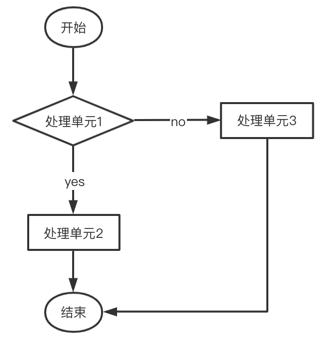

# WAPI流程编排工具

## 简述

### 什么是WAPI
&emsp;&emsp; WAPI是框架提供的标准流程管理模块，是框架对外提供的一套接口，具有流程编排的能力，页面调用WAPI接口，后台会根据xml中配置好的流程，按照流程中定义好步骤去调用具体的处理单元，并返回最终数据。

&emsp;&emsp; WAPI，它是一种服务编排式设计，目的将组织逻辑与业务实现分离，使业务应用更多的关注自身领域，理想目标是使开发人员只注重简单接口（行为）开发，业务人员通过服务编排即可实现业务及应用的组装和运维。

&emsp;&emsp; WAPI中，服务的执行单元和执行顺序由xml配置定义，在程序启动时将xml配置转换成pojo类加载到内存当中，一次wapi请求获得的结果，实际是由wapi接口内部根据配置顺序调用多个执行单元处理得到的最终输出的结果。

&emsp;&emsp; 按照Restful风格，每种业务的一个处理集合resource可按照请求类型分为post、delete、put、get（对应增删改查）四种flow处理流程，在每个flow处理流程下配置unit处理单元（简单接口或行为）的执行顺序，考虑到一些unit处理单元被执行时，无需等待其结果返回或是需要根据输出条件才能决定下一步调用等情况，处理单元的单元类型除了正常的普通顺序执行（Task）之外，还增加了异步执行（Async），分支执行(Gateway)共三种单元类型。在wapi调用处理单元时，会根据不同的单元类型做不同的处理。

### 三种执行流程
#### 1.普通执行流程


&emsp;&emsp;普通执行流程中，各处理单元被顺序的执行，上一步的执行结果通过WapiUnitParam对象携带到下一个处理单元中，如果上一个处理单元未执行完则不会进入到下一个处理单元。任意一个处理单元执行结果返回失败，则整个执行流程失败，整体进行事物回滚。

#### 2.异步执行流程


&emsp;&emsp;异步执行流程中，以上图为例，当处理单元2的单元类型为async时，此时处理单元2会通过其它线程被异步的执行，处理单元1在调用了处理单元2后后立即调用下一个处理单元，不再等待处理单元2的返回结果。一般用于某些处理单元执行速度较慢的情况。

#### 3.分支执行流程



&emsp;&emsp;分支执行流程中，如上图所示，允许根据处理单元1的返回结果，判断下一步的调用方向。不同于在代码中的逻辑判断，这是一种更为细腻的逻辑控制，可将原本的代码中条件逻辑判断分割为多个原子级的处理单元实现。一般用于需要从业务层面进行条件判断的业务场景。


## :star:首次初始化XML须知:star:

若未使用XML配置过WAPi流程，那么系统启动时将自动在指定目录生成XML流程配置文件，文件生成后将直接退出系统，并强制用户重启
::: tip 触发条件

以mysql环境为例，Wapi的XML配置文件的读取路径为本地项目的resources/wapi/mysql目录，如果本地resources目录下没有wapi/mysql目录，则项目启动时会自动读取数据库流程配置，并在resources目录下创建wapi/mysql目录，并生成默认的配置文件data-resource-config.xml

:::

**内容生成逻辑**
1. 获取jar中的xml文件定义的流程，注意：引入的所有jar中不允许有重复的key
2. 从配置库中读取data_process、data_process_flow、data_process_unit三张表的流程配置，转为WapiRoot类
3. **去重，jar包中已存在的相同的流程配置，不会再在本地生成**（即：当pom中引入框架后，生成的流程配置文件将不包含框架的流程配置，全部为业务系统自身的流程配置）

注意：**相同的流程配置**指其处理单元的数量、执行顺序、参数等都相同

## 配置增删改查流程
以mysql环境为例，下面为一个业务如 "a_demo" 配置一个标准的增删改查流程，并通过请求对数据进行增删改查
1. 以XML的格式配置流程，在resources/wapi/mysql目录下新建一个demo-resource-config.xml文件，内容为
```xml
<?xml version="1.0" encoding="UTF-8"?>
<wapi:root xmlns:wapi="http://www.screw.com/wapi"
           xmlns:xsi="http://www.w3.org/2001/XMLSchema-instance"
           xsi:schemaLocation="http://www.screw.com/wapi /wapi/data-resource-config.xsd">

   <wapi:resource key="a_demo" name="" desc="">
      <wapi:post name="新增流程" license="" desc="">
         <wapi:task order="1" next="2" name="唯一性检验" impl="uniquenessCheck">
            <wapi:params>
               <wapi:param name="default">{statement_id:"_STD_GET_one_record",valiator_map:[{db_name:"name",message:"lang_key.screw.global.recordexists"}]}</wapi:param>
            </wapi:params>
         </wapi:task>
         <wapi:task order="2" next="-1" name="标准插入单表处理" impl="StdSingleInsertService">
            <wapi:params>
               <wapi:param name="default">{table_name:"a_demo",primery_key_column:"id"}</wapi:param>
            </wapi:params>
         </wapi:task>
      </wapi:post>

      <wapi:get name="查询流程" license="" desc="">
         <wapi:task order="1" next="2" name="标准数据查询处理" impl="StdSimpleQueryService">
            <wapi:params>
               <wapi:param name="default"></wapi:param>
            </wapi:params>
         </wapi:task>
         <wapi:task order="2" next="-1" name="标准的List&lt;Rowvalue&gt;转换成List&lt;map&gt;处理" impl="ListRowValueTransform">
            <wapi:params>
               <wapi:param name="default"></wapi:param>
            </wapi:params>
         </wapi:task>
      </wapi:get>

      <wapi:delete name="删除流程" license="" desc="">
         <wapi:task order="1" next="-1" name="标准的批量删除" impl="StdMultiDeleteService">
            <wapi:params>
               <wapi:param name="default">{primery_key_column:"ids"}</wapi:param>
            </wapi:params>
         </wapi:task>
      </wapi:delete>

      <wapi:put name="更新流程" license="" desc="">
         <wapi:task order="1" next="2" name="唯一性检验" impl="uniquenessCheck">
            <wapi:params>
               <wapi:param name="default">{primery_key_column:"id",statement_id:"_STD_GET_one_record",valiator_map:[{db_name:"name",message:"lang_key.screw.global.recordexists"}]}</wapi:param>
            </wapi:params>
         </wapi:task>
         <wapi:task order="2" next="-1" name="标准更新单表处理" impl="StdSingleUpdateService">
            <wapi:params>
               <wapi:param name="default"></wapi:param>
            </wapi:params>
         </wapi:task>
      </wapi:put>
   </wapi:resource>

</wapi:root>
```

2. 定义业务的增删改查sql，在com/ais/**/mapper/*.xml路径下建立mybatis的mapper文件，内容格式如下：

**注意：标准增删改删流程默认执行的sql的id以 \_STD_GET_ 等开头再加上业务的key值 "a_demo" 为固定格式**，可通过配置\<param\>标签指定入参statement_id的值来指定需要执行的sql
```xml
<?xml version="1.0" encoding="UTF-8"?>
<!DOCTYPE mapper PUBLIC "-//mybatis.org/DTD Mapper 3.0//EN"
        "http://mybatis.org/dtd/mybatis-3-mapper.dtd" >
<mapper namespace="default.a_demo">

    <select id="_STD_GET_one_record" parameterType="java.util.Map" resultType="java.util.Map">

    </select>

    <select id="_STD_GET_a_demo" parameterType="java.util.Map" resultType="java.util.Map">
       <!-- 查询示例 -->
       select * from a_users
    </select>

    <insert id="_STD_POST_a_demo" parameterType="java.util.Map">

    </insert>

    <delete id="_STD_DELETE_a_demo" parameterType="java.util.Map">

    </delete>

    <update id="_STD_PUT_a_demo" parameterType="java.util.Map">
       
    </update>

</mapper>

```


3. 配置nameSpace和dbName路由信息，告知程序去哪可以找到sql，并在哪个库中执行

   a. 在resources目录下，新建 xx-db-router-config.xml 文件
   代码示例：
```xml
<?xml version="1.0" encoding="UTF-8"?>
<root>
    <!-- demo 路由示例  -->
   <object name="a_demo" dbName="default" nameSpace="default.a_demo"/>
</root>
```

b. .properties配置文件中增加如下配置项，加载该文件

```properties
config.dbconfig.loadorder=xx-db-router-config.xml
```

4. 调用wapi接口，对数据进行增删改查
   | 操作 | 请求类型 | 调用地址                                           |
   | ---- | -------- | -------------------------------------------------- |
   | 查询 | get      | case1: /wapi/v2/resourceKey <br/> case2: /wapi/v2/resourceKey^get <br/> case3: /wapi/v2/resourceKey^get/id（根据id查询的实现类需自行实现） <br/> case4: /wapi/v2/resourceKey/get <br/> case5: /wapi/v2/resourceKey/get/id（根据id查询的实现类需自行实现）|
   | 新增 | post     | case1: /wapi/v2/resourceKey <br/> case2: /wapi/v2/resourceKey^post  <br/> case3: /wapi/v2/resourceKey/post                               |
   | 更新 | post     | case1: /wapi/v2/resourceKey^put/id <br/> case2: /wapi/v2/resourceKey/put/id                        |
   | 删除 | post     | case1: /wapi/v2/resourceKey^delete/id   <br/> case2: /wapi/v2/resourceKey/delete/id                 |
   测试一下GET流程：

为方便测试，先将权限相关拦截器关掉，修改配置项：
```properties
config.security.login.filterEnabled=false
config.security.operation.filter.enabled=false
```
发送GET请求，调用a_demo的get流程，数据由`_STD_GET_a_demo`的sql查询出：
```shell
curl http://127.0.0.1:9001/demo_server_war_exploded/wapi/v2/a_demo
```
此时，在配置正确的情况下，你应该可以得到a_users用户表的所有信息

5. 定义通用单元处理类

上述例子中使用的 <wapi:task>标签的impl参数使用的是框架已经内置的处理类，大多数情况下我们需要使用自定义的处理类

定义一个通用的单元处理类，<wapi:task>标签的impl值对应`DemoWapiTaskUnit`的bean的名称即可：
```java
@Component
public class DemoWapiTaskUnit implements WapiTaskUnit {

   @Override
   public WapiUnitResult execute(WapiUnitParam param) {
      // TODO 逻辑处理
      // 获取<wapi:params>标签下的所有参数值，name作为key，标签值作为value
      Map<String, WapiParam> params = param.getUnit().getParams();

      if(1==1){
         // 返回成功，继续执行下一步操作
         return new WapiUnitResult().success();
      }
      // 返回失败，下一步处理将不会执行
      return new WapiUnitResult().failure(WapiEnumCode.OPERATION_PERMISSION_DENIED);
   }
}
```

## 配置分支执行流程
1. 定义分支单元处理类

分支的下一步走向由execute方法的返回值决定，每个返回值都对应下一步处理单元的序号

代码示例：
```java
@Component
public class DemoWapiGatewayUnit implements WapiGatewayUnit {

    @Override
    public String execute(WapiUnitParam param) {
        if(1==1){
            // TODO 业务代码
            return "yes";
        }
        return "no";
    }
}
```

2. 修改示例的get流程，增加分支判断，当返回值为yes时，下一步将对结果集进行转换处理，如果为no，则结束流程
```xml
<wapi:get name="查询流程" license="" desc="">
   <wapi:task order="1" next="2" name="标准数据查询处理" impl="StdSimpleQueryService">
       <wapi:params>
           <wapi:param name="default"></wapi:param>
       </wapi:params>
   </wapi:task>
   <!-- 分支判断 -->
   <wapi:gateway order="2" next="-1" name="分支判断" impl="demoWapiGatewayUnit">
       <wapi:params>
           <wapi:param name="default"></wapi:param>
       </wapi:params>
       <wapi:results>
           <wapi:result when="yes" then="3"/>
           <wapi:result when="no" then="-1"/>
       </wapi:results>
   </wapi:gateway>
   <wapi:task order="3" next="-1" name="标准的List处理,数据转为Rowvalue集合" impl="ListRowValueTransform">
       <wapi:params>
           <wapi:param name="default"></wapi:param>
       </wapi:params>
   </wapi:task>
</wapi:get>
```

## 配置异步执行流程
1. 定义异步单元处理类

我们在execute方法中模拟一个耗时较长的操作

代码示例：
```java
@Component
public class DemoWapiAsyncUnit extends WapiAsyncUnit {

   @Override
   public void setAsyncParam(WapiUnitParam param) {
      // TODO 设置参数示例
      this.setParamMap(new HashMap<String, Object>(){
         {
            put("dataId",param.getWapiRequest().getDataId());
         }
      });
   }

   @Override
   public void execute() {

      try {
         // 获取参数
         Map<String, Object> data = this.getParamMap();
         // TODO 异步操作
         Thread.sleep(5000);
      } catch (InterruptedException e) {
         throw new ApiException(e);
      }
   }
}
```

2. 修改示例的put流程，异步更新数据
```xml
<wapi:put name="更新流程" license="" desc="">
   <wapi:async order="1" next="-1" name="异步更新操作" impl="demoCustomWapiAsyncUnit">
      <wapi:params>
         <wapi:param name="default"></wapi:param>
      </wapi:params>
   </wapi:async>
</wapi:put>
```

最后测试一下：
```shell
curl -X POST http://127.0.0.1:9001/demo_server_war_exploded/wapi/v2/a_demo/put/1
```
观察输出可以发现，调用wapi接口后会立即返回成功，而后台任务实际还在执行中


## WAPI请求工作流拦截器
WAPI请求工作流拦截器，用于解决部分业务期望在所有WAPI业务请求的部分阶段修改过程变量包括请求参数的场景。

代码示例：
```java
import org.springframework.stereotype.Component;

/**
 * Wapi请求拦截器
 * 可配置多个拦截器，并实现order方法定义执行顺序
 */
@Component
public class XXXXWapiInterceptor implements WapiInterceptor {

    @Override
    public int order() {
        // 返回执行顺序，请大于Integer.MIN_VALUE
        return 100;
    }

    @Override
    public boolean preHandle(WapiRequest request, WapiResponse<?> wapiResponse) {
        // 修改请求参数
        return true; //返回true标识允许通过
    }

    @Override
    public void postHandle(WapiRequest request, WapiResponse<?> response) {
        // 请求后置处理
        // 用于处理返回体内容
    }

    @Override
    public void afterCompletion(WapiRequest request, WapiResponse<?> response, WapiProcessor processor, Exception ex) {
        // 结束当前请求，若有异常，将在此拦截
    }
}
```

## 流程工具类-WapiResourceService
流程工具类WapiResourceService，类使用JAXB的xml开发包，将xml配置转成pojo类，方便我们以对象的方式读取xml的配置。其中提供了加载xml配置、从数据库加载流程配置、获取流程、获取配置内容等方法。

| 方法名                                                  | 作用                                                         |
| ------------------------------------------------------- | ------------------------------------------------------------ |
| refresh()                                               | 重新加载流程配置                                             |
| getResource(String resourceKey)                         | 根据resourceKey返回资源对象                                  |
| getFlow(String resourceKey, String flowType)            | 根据resourceKey和请求类型返回流程对象                        |


## 配置文件读取说明
::: tip 提示
1. mysql和oracle环境的流程配置由于一些字段名称不同，无法共用，需要在不同的目录下配置，程序启动时会根据连接的数据库环境，从mysql或oracle目录择一读取

2. 可按照模版划分在子目录存放配置文件
   :::

mysql环境文件读取目录： 所有jar包中的resources/wapi/mysql 目录+本地项目的resources/wapi/mysql 目录

oracle环境文件读取目录： 所有jar包中的resources/wapi/oracle 目录+本地项目的resources/wapi/oracle 目录

以mysql环境为例，项目启动时：
1. 从所有的jar包中的resources/wapi/mysql 目录加载XML流程配置
2. 从项目本地资源目录resources/wapi/mysql 目录加载XML流程配置
3. 合并相同的流程，本地资源中流程根据相同的key覆盖jar包中流程

::: warning 注意

1. 从所有jar包中读取的流程配置不允许出现相同的resource:key，否则会抛出**WapiDuplicateResourceKeyException**异常
2. 从项目本地资源目录下读取的流程配置不允许出现相同的resource:key，否则会抛出**WapiDuplicateResourceKeyException**异常
3. **业务系统是多模块的项目时，建议wapi流程配置放在同一个模块下，避免多模块间互相引用导致业务系统自身出现流程覆盖的情况**

:::


## 流程覆盖方式
以mysql环境为例

wapi流程配置的覆盖级别为GET、POST级别（即<wapi:get>等标签下内容）（注意：不是<wapi:resource>标签下的所有内容），即当业务系统需要覆盖框架的流程配置时，只需两步：
1. 在业务系统resources/wapi/mysql 目录下任意的.xml文件中定义一个相同的resource：key
2. 重写其flow流程也就是<wapi:get>、<wapi:post>等标签下内容。

**例如：**

框架中默认提供了一个demo流程集，包含查询和新增流程：
```xml
 <wapi:resource key="demo" name="demo示例" desc="这是一个demo">
    <wapi:get name="这是一个查询流程" license="" desc="">
      <wapi:task order="1" next="2" name="标准数据查询处理" impl="StdSimpleQueryService">
        <wapi:params>
          <wapi:param name="default"></param>
        </wapi:params>
      </wapi:task>
      <wapi:task order="2" next="-1" name="标准的List&lt;Rowvalue&gt;转换成List&lt;map&gt;处理" impl="ListRowValueTransform">
        <wapi:params>
          <wapi:param name="default"></param>
        </wapi:params>
      </wapi:task>
    </wapi:get>
    <wapi:post name="这是一个新增流程" license="" desc="">
        <wapi:task order="1" next="-1" name="创建demo" impl="CustomAddService">
            <wapi:params>
                <wapi:param name="default"></param>
            </wapi:params>
        </wapi:task>
    </wapi:post>
  </wapi:resource>
```
现在我们只想修改它的查询流程(新增流程不变)，在标准数据查询前增加一个查询前置处理，只需要在业务系统resources/wapi目录下任意.xml文件中定义一个相同的resource:key为demo，然后重写get流程即可：
```xml
 <wapi:resource key="demo" name="demo示例" desc="这是一个demo">
    <wapi:get name="demo查询流程示例" license="" desc="">
        <wapi:task order="1" next="2" name="这是一个查询前置操作" impl="CustumQueryService">
            <wapi:params>
                <wapi:param name="default"></param>
            </wapi:params>
        </wapi:task>
        <wapi:task order="2" next="3" name="标准数据查询处理" impl="StdSimpleQueryService">
            <wapi:params>
              <wapi:param name="default"></param>
            </wapi:params>
        </wapi:task>
        <wapi:task order="3" next="-1" name="标准的List&lt;Rowvalue&gt;转换成List&lt;map&gt;处理" impl="ListRowValueTransform">
            <wapi:params>
              <wapi:param name="default"></wapi:param>
            </wapi:params>
        </wapi:task>
    </wapi:get>
  </wapi:resource>
```
## 结构体说明
### XML配置参数说明
1. <wapi:param>标签

你可以定义多个<wapi:param>标签，name将作为key，标签内容作为value，作为入参映射到`WapiUnit`对象中
```xml
<wapi:param name="default">{primery_key_column:"id",statement_id:"_STD_GET_one_record",valiator_map:[{db_name:"name",message:"lang_key.screw.global.recordexists"}]}</wapi:param>
<wapi:param name="key">value</wapi:param>
```
在流程处理单元中可以`WapiUnitParam`获取到该参数
```java
@Component
public class DemoWapiTaskUnit implements WapiTaskUnit {

   @Override
   public WapiUnitResult execute(WapiUnitParam param) {
      // TODO 逻辑处理
      // 获取<wapi:params>标签下的所有参数值，name作为key，标签值作为value
      Map<String, WapiParam> params = param.getUnit().getParams();

      if(1==1){
         // 返回成功，继续执行下一步操作
         return new WapiUnitResult().success();
      }
      // 返回失败，下一步处理将不会执行
      return new WapiUnitResult().failure(WapiEnumCode.OPERATION_PERMISSION_DENIED);
   }
}
```
::: tip 补充说明
首次生成的XML配置都含有<wapi:param name="default">标签，该标签的值在旧版的流程处理类中将作为方法的`unitParam`,`processParam`参数传入
:::


### XML配置对应实体类说明
#### root
实体类描述 ： 用于映射xml结构体顶层节点，负责命名空间相关信息配置，下辖若干业务资源配置集

| 名称       | 数据类型                            | xml元素名 | xml元素类型 | 是否必须 | 描述             |
| ---------- | --------------------------------- | --------- | ----------- | ----------- | ------------------------------- |
| resources  | List<@resource>                    | resource  | Attribute   | 是       | resource流程名称 |


#### resource
实体类描述：wapi服务业务资源对象，用于描述某种业务资源的相关操作

| 名称       | 数据类型                                             | xml元素名                 | xml元素类型 | 是否必须 | 描述                                                 |      
| ---------- | ---------------------------------------------------- | ------------------------- | ----------- | -------- | ---------------------------------------------------- |
| key       | String                                               | key                      | Attribute   | 是       | 流程key定义，全局唯一                                   |  
| flows      | List<@Flow>                                          | flow[get/post/put/delete] | Elements    | 是       | 使用List集合描述该资源下的四种资源操作，分别对应CURD | 

#### flow

实体类描述：对应rest服务的操作类型  注：此类为抽象类，需要继承实现为具体的Get、Post、Put、Delete

| 名称       | 数据类型                                                     | xml元素名                | xml元素类型 | 是否必须 | 描述                                   |
| ---------- | ------------------------------------------------------------ | ------------------------ | ----------- | -------- | -------------------------------------- |
| type       | String                                                       | get、post、put、delete   | Element     | 是       | 描述流程的协议类型                     |
| name       | String                                                       | name                     | Attribute   | 否       | flow的                                 |
| license    | String                                                       | license                  | Attribute   | 否       | license值                              |
| desc       | String                                                       | desc                     | Attribute   | 否       |                                        |
| units      | List<@Unit>                                                  | unit[task/async/gateway] | Elements    | 是       | 使用List结合描述该流程下的若干执行单元 |


#### Unit

实体类描述： 基本操作单元，即业务实现类  此类为抽象类，需要继承实现为具体的执行单元类型，如Gateway、Async、Task

| 名称       | 数据类型                                                     | xml元素名 | xml元素类型 | 是否必须 | 描必须述                                     |
| ---------- | ------------------------------------------------------------ | --------- | ----------- | -------- | -------------------------------------------- |
| order      | Integer                                                      | order     | Attribute   | 是       | 指定执行顺序号，值越小越先执行               |
| next       | Integer                                                      | next      | Attribute   | 是       | 指定下一步指定单元顺序号，-1代表结束当前流程 |
| name       | String                                                       | name      | Attribute   | 否       | 执行单元的名称                               |
| impl       | String                                                       | impl      | Attribute   | 是       | 执行单元的bean名称或指定的类全路径名         |

### 封装类结构说明
#### WapiResponse（Wapi接口返回体)

| 参数    | 参数说明                                |
| ------- | --------------------------------------- |
| success | 请求是否成功,true/false                 |
| desc    | 描述信息                                |
| code    | 错误码，具体定义请见扩展章节 错误码说明 |
| data    | 返回的数据                              |

#### WapiRequest（Wapi请求参数封装类）

| 参数         | 参数说明                                                     |
| ------------ | ------------------------------------------------------------ |
| request      | 对应xml配置中<wapi:resource>标签的name属性，wapi根据所传的pricessName和action请求类型执行相应的处理流程 |
| requestParam | 放在param中入参                                              |
| requestBody  | 放在body中的入参                                             |
| resourceName | 资源名称，根据该名称找对应的xml配置                          |
| method       | 请求类型，put/post/get/delete                                |
| dataId       | 数据的id，用于put/delete操作，根据id更新或删除数据           |
| userId       | 用户id，用于操作日志记录                                     |

#### WapiUnitParam（单元执行入参封装类）

| 参数       | 参数说明                                                     |
| ---------- | ------------------------------------------------------------ |
| request    | WapiRequest对象                                              |
| unit       | 即处理单元Unit对象，包含该处理单元的信息如名称、下一个处理单元序号、实现类全名等 |
| currResult | 即WapiUnitResult对象，用于下一个处理单元获取上一个处理单元执行结果 |


## 预置处理类
对于增删改查及参数校验，框架提供了部分实现类用以直接使用

| 预置类名称                              | 接口                       | 实现类                            |
| --------------------------------------- |--------------------------|--------------------------------|
| 标准更新单表处理                        | ModifyPersistanceService | stdSingleUpdateService         |
| 标准数据查询处理                        | QueryPersistanceService  | stdSimpleQueryService          |
| 标准插入单表处理                        | InsertPersistanceService | stdSingleInsertService         |
| 标准删除处理                            | DeletePersistanceService | stdSingleDeleteService         |
| 标准的新增list数据单表处理              | InsertPersistanceService | stdMultiInsertService          |
| 标准的判断集合是否为空分支处理          | BusinessBranchService    | stdCollectionIsEmptyBranch     |
| 标准的List&lt;Rowvalue&gt;转换成List&lt;map&gt;处理 | WapiDataTransform        | listRowValueTransform          |
| 标准的批量删除                          | DeletePersistanceService | stdMultiDeleteService          |
| 标准参数校验                            | WapiValidator            | paramValidator                 |
| 标准的批量更新处理                      | ModifyPersistanceService | stdMultiUpdateService          |
| 扩展字段标准新增单元                    | InsertPersistanceService | additionColumnInsertService    |
| 扩展字段标准更新单元                    | ModifyPersistanceService | additionColumnUpdateService    |
| 扩展字段标准查询转换单元                | WapiDataTransform        | additionColumnValueTransform   |
| 扩展字段标准删除单元                    | DeletePersistanceService | additionColumnDeleteService    |
| 标准导入实现类                          | BaseAsyncTask            | baseImportAsyncTask            |
| 标准导入模板生成服务                    | QueryPersistanceService  | stdImportFormatGenerateService |
| 标准查询数据是否被引用                  | WapiValidator            | referenceValidator             |
| 标准前台时间转换                        | WapiPreOperate           | datePickerPreOperate           |


### ParamValidator（后台参数校验类）
用于校验字段必填、邮箱格式是否正确、指定字段是否超过最大、最小长度、电话是否合法、正则表达式、日期类型、正则表达式等。

入参为指定json格式，配置<wapi:param name="default"></param>中：

```json
{
valiator_map:[
   {db_name:"param1",required:true,column_name:"用户"},     		    
   {db_name:"param2",required:true,maxlength:10,column_name:""}
],
validator_class:""
}
```
* valiator_map

字段说明：

| 规则                                                | 描述                                                         |
| --------------------------------------------------- | ------------------------------------------------------------ |
| required:true                                       | 必须输入的字段。                                             |
| email:true                                          | 校验正确格式的电子邮件                                       |
| datestr:true,format:“yyyy-mm-dd”                    | 字符串的日期的格式是否符合yyyy-mm-dd,若format不配，默认format的值是yyyy-mm-dd hh:mm:ss |
| maxlength:5                                         | 输入长度最多是 5 的字符串                                    |
| minlength:10                                        | 输入长度最小是 10 的字符串                                   |
| phone:true                                          | 校验电话是否正确                                             |
| db_name                                             | 需要校验的数据库字段                                         |
| column_name                                         | 提示语需要展示的字段名                                       |
| regex:"^[\\u4e00-\\u9fa5]+$",message:"只能输入中文" | Regex:正则表达式,message:对正则表达式的描述                  |

* validator_class

  自定义校验类名，若有多个已逗号分隔, 如果valiator_map中有校验规则未通过，则不进行下面的自定义校验。

**valiator_map可选的校验规则如下所示：**

| 校验规则                                                                                          | 描述                                                      |
|:----------------------------------------------------------------------------------------------| --------------------------------------------------------- |
| {db_name:"param1",required:true,column_name:"用户"}                                             | 用户字段为必填，column_name表示需要显示在前台             |
| {db_name:"param2",required:true,maxlength:10,column_name:""}                                  | 必填并且最大长度为10                           |
| {db_name:"param3",required:true,minlength:2,column_name:""}                                   | param3字段 必填并且最小长度为2                            |
| {db_name:"param4",required:true,regex:"^[\\u4e00-\\u9fa5]+$",message:"只能输入中文",column_name:""} | param4字段 必填并且只能填写中文                           |
| {db_name:"param5",required:true,datestr:true,format:"yyyy-mm-dd  hh:mm:ss",column_name:""}    | param5字段 必填并且字符串的日期的格式是否符合yyyy-mm-dd,若format不配，默认format的值是yyyy-mm-dd hh:mm:ss |
| {db_name:"param6",required:true,email:true}                                                   | Param6字段 校验email格式                                  |
| {db_name:"param7",required:true,phone:true}                                                   | Param7字段 校验电话格式                                   |
| {db_name:"param8",required:true,ipv4:true}                                                    | Param8字段 校验ipv4格式                                   |
| {db_name:"param9",required:true,ipv6:true}                                                    | Param9字段 校验ipv6格式                                   |
| {db_name:"param10",required:true,checkMAC:true}                                               | Param10字段 校验mac格式                                   |
| {db_name:"param11",required:true,checkDomain:true}                                            | Param11字段 校验域名格式                                  |
| {db_name:"param12",required:true,digits:true}                                                 | Param12字段 校验数字                                      |

### UniquenessCheck (唯一性验证类)
用于数据新增或更新时的字段唯一性校验，支持单字段和多字段组合验证。

入参为指定json格式，配置<wapi:param name="default"></param>中：

* 相关字段解释

  | 字段名             | 备注                                           |
   | ------------------ | --------------------------------------------- |
  | statement_id       | mybatis的具体执行sql的唯一的id标识符           |
  | valiator_map       | 校验规则                                       |
  | db_name            | 字段名称                                       |
  | message            | 提示信息                                       |
  | condition          | 唯一性校验的条件字段，可以配置多个，以逗号隔开 |
  | primery_key_column | 主键id                                         |

* 新增数据唯一性校验：

```json
{
 statement_id:"_STD_GET_demo",
 valiator_map:[
   {db_name:"param1",message:"param1不能重复",condition:"condition1,condition2"},
   {db_name:"param2,param3",message:"param2和param3组合查询记录存在，记录不能重复",condition:""}
 ]
}
 ```

* 更新数据唯一性校验：
```json
{
    primery_key_column:"viewid",
    statement_id:"_STD_GET_demo",
    valiator_map:[
      {db_name:"param1",message:"param1不能重复",condition:""},
      {db_name:"param2,param3",message:"param2和param3组合查询记录存在，记录不能重复",condition:""}
    ]
}
```

* 处理逻辑
    1. 根据业务标识objType查找screw-db-router-config.xml文件，确定操作数据库信息
    2. 新增或更新的数据转成map对象
    3. 根据入参中配置的db_name从map对象中获取值，作为查询sql的条件
    4. 在没有指定statement_id情况下，默认使用\_STD_GET_+objType标识的查询sql
    5. 如果查询出的记录不为空，返回失败信息

### 标准数据增删改查处理类

对于标准增删改查等流程，如果没有指定执行sql的statement_id，框架会通过配置在screw-db-router-config.xml中的路由信息去指定mapper文件找需要执行的sql

* screw-db-router-config.xml配置示例：

```xml
  <object name="a_users" dbName="default" nameSpace="screw.a_users"></object>
```
| 字段名    | 备注                                                  |
| :-------- |-----------------------------------------------------|
| name      | 业务标识，对应objectType                                   |
| dbName    | 数据库名，在数据源配置文件如：screw-persistence.xml中定义，规定在哪个数据库中操作 |
| nameSpace | mybaits的mapper的命令空间                                 |

* 执行sql的固定格式为：nameSpace+操作类型+业务标识
  | 操作类型                                     | 关键字              |
  | -------------------------------------------- | ------------------- |
  | 查询                                         | \_STD_GET_          |
  | 新增                                         | \_STD_POST_         |
  | 更新                                         | \_STD_PUT_          |
  | 多表操作                                     | \_STD_MULTI_        |
  | 批量插入                                     | \_STD_BATCH_INSERT_ |
  | 清空表（主要用于全量导入，导入前清空表数据） | \_STD_TRUNCATE_     |

**例如：**
查询用户的sql唯一标识为：screw.a_users.\_STD_GET_a_users
```xml
<select id="_STD_GET_a_users" parameterType="java.util.Map" resultType="java.util.Map">
      select name from users where 1=1
</select>
```

